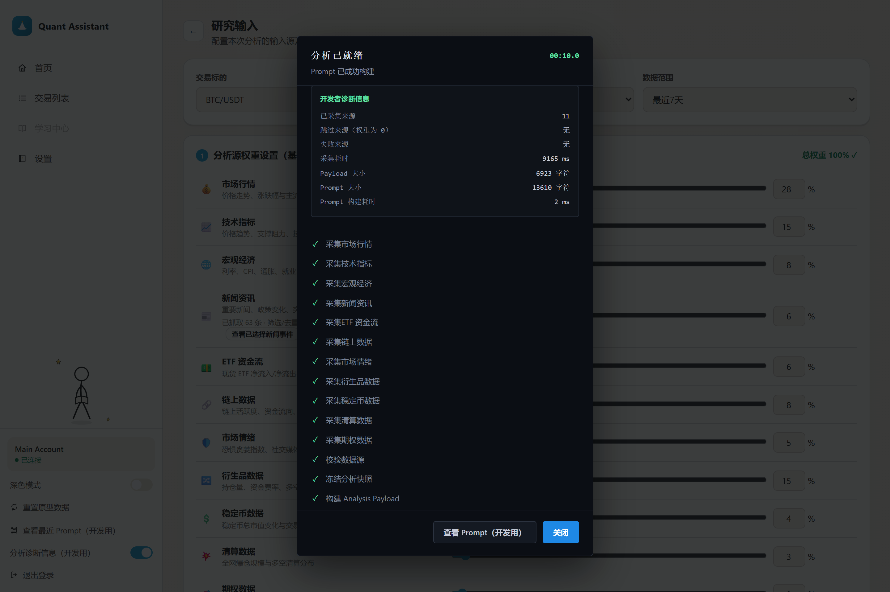

# AI Trading Decision System

一个让 AI 基于多源市场信息、账户状态与风险约束，完成**市场分析 → 交易决策 → 风控 → 测试网执行 → 持续管理**的实验系统。

它不是传统意义上的因子量化、统计套利或高频交易系统。这个项目关注的是：**如何把交易者原本依赖人工完成的决策过程，结构化为 AI 可以持续运行、可追踪、可验证、可约束的系统。**

> 当前交易写操作硬性限制为 Binance Futures TESTNET（币安合约测试网），不提供“一键切换实盘”。



▶ [User Journey Demo（用户旅程演示）](assets/demo/user-journey-demo.mov)

## 一笔决策如何产生

```text
Market Data（市场数据）
        ↓
Market Facts（市场事实）
        ↓
AI Judgment（AI 判断）
        ↓
Trading Strategy（交易策略）
        ↓
Account / Position Context（账户 / 持仓状态）
        ↓
Final Decision（最终决策）
        ↓
Risk Guard（风险守卫）
        ↓
Execution（测试网执行）
        ↓
Monitoring / Reconciliation（持续监控 / 对账）
```

更完整的真实架构见 [`docs/architecture/ARCHITECTURE.md`](docs/architecture/ARCHITECTURE.md)。

## 已经真实跑通

- **11 类市场信息并行采集**：行情、技术指标、宏观、新闻、ETF 资金流、链上、情绪、衍生品、稳定币、清算、期权。
- **Account Snapshot（账户快照）**：读取 Binance 账户 / 持仓并进入分析上下文。
- **统一 Analysis Engine（分析引擎）**：Manual / Automatic Analysis（手动 / 自动分析）共享同一条执行链路。
- **Analysis Evidence（分析证据）**：保存 Payload（输入数据）、Prompt（提示词）、AI 原始响应与解析结果。
- **Structured Decision（结构化决策）**：AI 输出经过 Validation（校验）后转换为 StrategyOrder（策略订单）。
- **Risk Guard（风险守卫）**：AI 建议与交易执行之间存在独立、确定性的规则校验层。
- **TESTNET Execution（测试网执行）**：真实调用 Binance Futures TESTNET 完成下单、撤单、止损止盈。
- **Monitoring / Reconciliation（监控 / 对账）**：持续跟踪订单与持仓，并处理本地状态与交易所状态不一致。
- **Kill Switch（紧急停止开关）**：自动化策略支持全局暂停。

## 为什么这个项目不只是一个 AI Demo（AI 演示原型）

### AI 输出不能直接等于交易指令

模型输出先经过 Output Schema（输出结构）与 Validation（校验），再生成系统可以理解的 StrategyOrder（策略订单）；执行前还会经过独立 Risk Guard（风险守卫）。

### 自动化系统必须处理失败与状态漂移

系统不仅记录“是否下单成功”，还维护 AnalysisRun Lifecycle（分析任务生命周期）、订单 / 持仓状态、保护单以及 RealTrade Reconciliation（真实交易对账）。

### 决策必须留下证据

一次分析不是只有最终答案。系统会保留当时的输入、Prompt（提示词）、AI 原始响应、解析结果和业务记录，为后续复盘与 Attribution / Learning（归因 / 学习）提供事实基础。

## Safety Boundary（安全边界）

- 下单、撤单、止损止盈、杠杆调整等交易所写操作目前只允许 Binance Futures TESTNET（币安合约测试网）。
- 对 LIVE（实盘）环境发起写请求会被代码直接拒绝。
- 账户 / 持仓读取可配置 TESTNET / LIVE，但当前项目验证以 TESTNET 为主。
- 转向 LIVE（实盘）需要显式开发与重新审查，不是配置切换。

## 技术实现

- **Backend（后端）**：Node.js + TypeScript（JavaScript 的类型化语言），原生 `http` 模块。
- **Storage（存储）**：JSON + SQLite（轻量级关系型数据库）。
- **Frontend（前端）**：单文件 HTML Dashboard（仪表盘）。
- **Exchange（交易所）**：Binance Futures（币安 USDT 本位合约）。
- **AI Providers（模型提供方）**：OpenAI / Anthropic / Google / DeepSeek / OpenAI-compatible（兼容 OpenAI 接口）。

## 本地运行

```bash
cd pipeline
npm install
npm run serve
```

默认服务地址：`http://localhost:8787`

然后打开：

```text
prototype/index.html
```

开发 / 检查命令：

```bash
cd pipeline
npm run dev
npm run typecheck
npm run fetch
npm run etf:snapshot
```

配置示例见 [`pipeline/.env.example`](pipeline/.env.example)。真实 `.env`、运行数据与日志不进入版本控制。

## Repository Map（仓库导航）

```text
├── README.md                         # 作品入口
├── assets/
│   ├── screenshots/                 # 展示截图
│   └── demo/                        # 用户旅程演示视频
├── pipeline/                         # 后端主路径
│   ├── src/analysis/                 # AI 分析引擎
│   ├── src/ai/                       # AI Provider（模型提供方）
│   ├── src/exchange/                 # Binance Futures 适配
│   └── src/strategy/                 # 风控、执行、自动化、监控、对账
├── prototype/                        # 当前前端
├── examples/                         # 经过脱敏的公开案例
├── test-fixtures/                    # 回归样本
└── docs/
    ├── architecture/                 # 当前真实架构
    ├── design/                       # 产品 / 决策设计
    ├── engineering/                  # 冻结工程契约
    ├── development/                  # 状态、路线图、里程碑
    └── archive/                      # 历史材料，不代表当前实现
```

完整文档导航见 [`docs/README.md`](docs/README.md)。

## 推荐阅读顺序

1. [`README.md`](README.md) — 先理解项目做什么。
2. [`docs/design/TRADING_DECISION_SYSTEM.md`](docs/design/TRADING_DECISION_SYSTEM.md) — 为什么这样设计决策系统。
3. [`docs/architecture/ARCHITECTURE.md`](docs/architecture/ARCHITECTURE.md) — 当前真实系统链路。
4. [`docs/development/PROJECT_STATUS.md`](docs/development/PROJECT_STATUS.md) — 当前状态与已知问题。
5. [`docs/engineering/`](docs/engineering/) — 深入查看工程契约。

## Current Direction（当前方向）

当前稳定基线为 `pre-ai-analysis-v2`。下一阶段正在重新定义 AI Analysis V2（AI 分析第二版）：

```text
市场事实 → 市场判断 → 交易策略 → 账户 / 持仓适配 → 最终决策
```

目标不是继续堆叠 Prompt（提示词），而是让 AI 的认知步骤、输入输出契约和执行边界更清楚。

路线图见 [`docs/development/ROADMAP.md`](docs/development/ROADMAP.md)。

## 关于“量化”

项目会使用程序化数据处理、技术指标、统计信息与规则风控等 Quantitative Methods（量化方法），但核心研究对象不是传统 Quant System（量化系统），而是：

**AI 能否在有数据、有账户上下文、有风险约束、有证据链的前提下，承担更完整的交易决策过程。**
